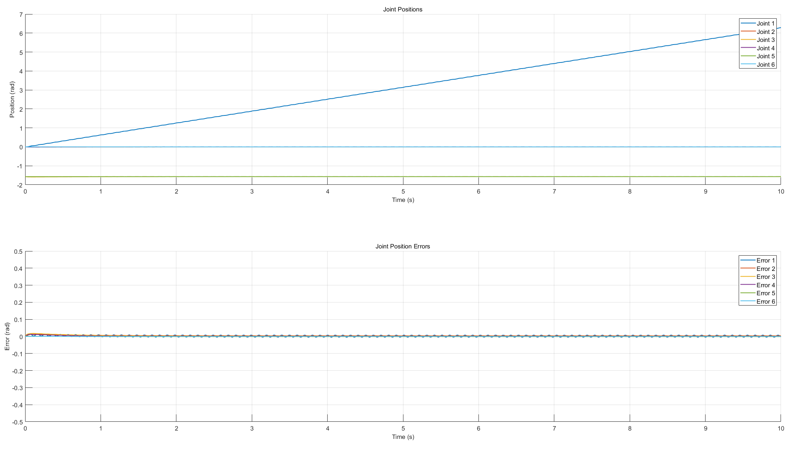
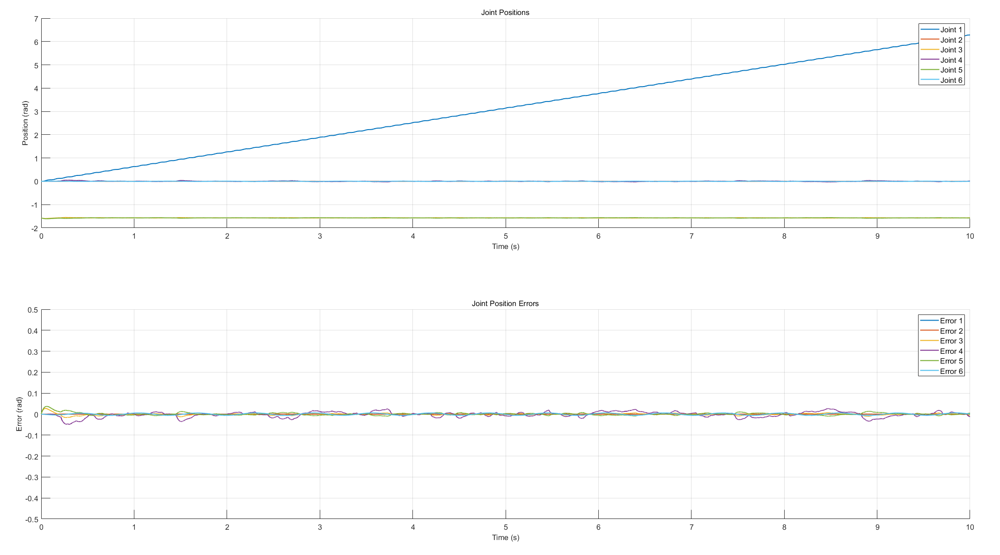

# Nuri3s Robust Control with Disturbance Observer

> 외란관측기(DOB)를 이용한 로봇 팔의 강인제어 및 제어 기법 비교 연구  
> 2025 세종대학교 하계 창의학기제 — 13번팀

## 개요

자체 제작 3축 로봇팔 **Nuri3s**에 대해 MATLAB/Simulink로 동역학 모델을 구성하고,  
여러 제어 기법을 비교하여 외란관측기(DOB) 기반 강인제어의 성능을 검증한 프로젝트입니다.

## 비교 제어 기법

| 기법 | 설명 |
|------|------|
| Open Loop | 피드백 없는 개루프 제어 |
| Feedforward | 순방향 보상 제어 |
| PD+G | 중력 보상 PD 제어 |
| PD+G + 불확실성 | 모델 불확실성 포함 PDG |
| Computed Torque Control (CTC) | 계산 토크 제어 |
| CTC + 불확실성 | 모델 불확실성 포함 CTC |
| **PD+G + DOB** | 외란관측기 적용 PDG (최종) |
| **CTC + DOB** | 외란관측기 적용 CTC (최종) |

## 파일 구조

```
nuri3s-robust-control/
├── Simulink_Model/          # 제어기 Simulink 모델 (.slx)
│   ├── nuri3s_basic_model.slx
│   ├── nuri3s_PDG.slx
│   ├── nuri3s_PDG_DOB_final1.slx
│   ├── nuri3s_CTC_DOB_final1.slx
│   └── ...
├── nuri3s_urdf/             # URDF 모델 및 STL 메시
│   └── nuri3s_matlab/
│       ├── nuri3s.urdf
│       └── Nuri3s_0~6.stl
├── PDG_DOB2_q_Tracking/     # 관절 각도 추적 결과 그래프
├── PDG_DOB2_Tracking_Result/ # 제어 성능 비교 그래프
├── initial_official.mlx     # 초기화 및 동역학 파라미터 설정
├── traj_test.mlx            # 궤적 생성 테스트
├── traj_test_PDG.mlx        # PDG 기반 궤적 추적 테스트
└── output_fig.mlx           # 결과 시각화
```

## 실험 조건 — 추정 모델(est2)

PDG+DOB 및 CTC+DOB 결과는 모두 **`robot_est2` (추정 모델)** 를 사용한 실험 결과입니다.

`robot_est2`는 Nuri3s 실제 URDF의 **질량(mass) 및 관성(inertia ixx) 파라미터를 ±10% 조정**하여 생성한 추정 모델로, 실제 로봇에서 발생하는 모델 불확실성(model uncertainty)을 시뮬레이션하기 위해 사용하였습니다.

```matlab
% initial_official.mlx 내 설정
urdfPath2 = '...nuri3s_estimated2.urdf';  % mass, inertia ±10% 조정
robot_est2 = importrobot(urdfPath2);
robot_est2.DataFormat = 'row';
robot_est2.Gravity = [0 0 -9.81];
```

DOB 내부의 역동역학 계산(D̂, Ĥ)은 이 `robot_est2`를 기반으로 수행되며, 실제 모델(`robot`)과의 오차가 외란으로 작용하는 상황에서 DOB가 이를 실시간으로 추정·보상하는 것을 검증합니다.

> **외란 조건**: sine wave, 진폭 0.1, 주파수 10 rad/s

## 실험 결과

### PDG+DOB (Gain 3 — 뉴로메카 공식 Gain, 불확실한 모델 + DOB)

> 불확실한 모델(est2)에 DOB를 적용한 결과. 상단: 관절 위치 추적, 하단: 추적 오차



에러가 ±0.05 rad 이내로 수렴하며 DOB가 모델 불확실성을 효과적으로 보상함을 확인.

### CTC+DOB (Gain 7 — 불확실한 모델 + DOB)

> CTC에 DOB + 적분 게인(Ki) 추가. 상단: 관절 위치 추적, 하단: 추적 오차



**Gain 7 파라미터:**

```
       J1    J2    J3    J4    J5    J6
Kp    900   800   500   300   300   250
Kd     40    45    40    40    30    30
Ki    500   400   300   250   250   150
```

## PDG+DOB 실험 Gain 설정 (PDG_DOB2 — 불확실한 모델 + DOB)

결과 그래프 (`PDG_DOB2_q_Tracking/`, `PDG_DOB2_Tracking_Result/`) 에 해당하는 Gain 값입니다.

| Gain | Kp (P gain) | Kd (D gain) | 비고 |
|------|-------------|-------------|------|
| Gain 1 | 40 (scalar) | 18 (scalar) | |
| Gain 2 | diag([100 100 100 100 100 100]) | diag([20 20 20 20 20 20]) | |
| Gain 3 | diag([70 70 40 25 25 18]) | diag([55 55 30 15 15 3]) | 뉴로메카 PD+G 공식 지정값 |
| Gain 4 | diag([100 100 170 100 170 150]) | diag([20 20 40 20 40 30]) | Gain 2에서 불안정 관절만 조정 |
| Gain 5 | diag([100 100 100 100 100 100]) | diag([20 20 40 20 40 100]) | |
| Gain 6 | diag([100 100 100 100 100 100]) | diag([20 20 100 20 100 150]) | |

## 요구 환경

- MATLAB R2023b 이상
- Simulink
- Robotics System Toolbox

## 실행 방법

1. `initial_official.mlx` 실행 → 동역학 파라미터 초기화
2. `Simulink_Model/` 내 원하는 제어기 모델 열기
3. Simulink 시뮬레이션 실행
4. `output_fig.mlx` 로 결과 그래프 확인
