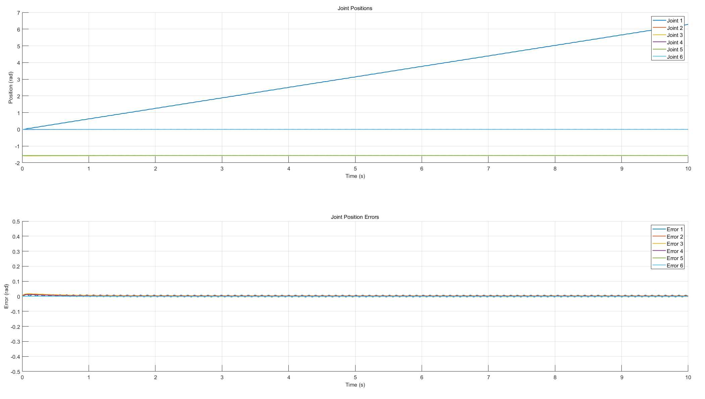
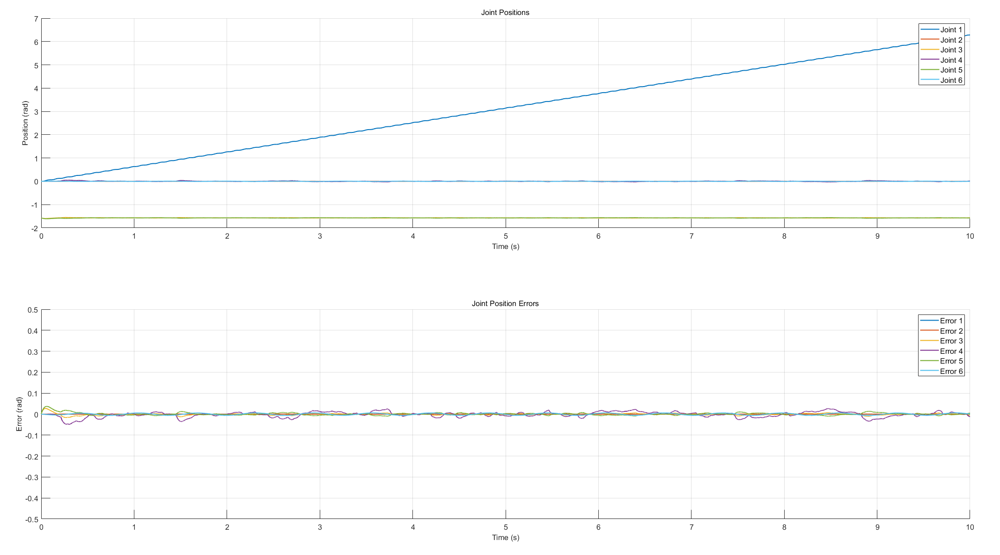

# Nuri3s Robust Control with Disturbance Observer

> 외란관측기(DOB)를 이용한 로봇팔의 강인제어 및 제어 기법 비교 연구
> **2025 세종대학교 하계 창의학기제 — 13번팀**


자체 제작 **6축(6-DOF) 로봇팔 Nuri3s**의 동역학 모델을 MATLAB/Simulink로 구성하고, 여러 제어 기법을 단계적으로 비교하여 **외란관측기(DOB) 기반 강인제어**의 성능을 검증한 프로젝트입니다.

---

## 제어기 개선 흐름

모델이 정확할 때는 고전 제어기로도 잘 추종되지만, 실제 로봇의 **모델 불확실성**과 **외란**이 더해지면 성능이 무너집니다.
본 프로젝트는 이 열화 과정을 단계적으로 재현하고, **DOB로 강인성을 회복**하는 흐름을 검증했습니다.

> **실험 모델**: 실제 모델 `robot` vs 추정 모델 `robot_est2` (질량·관성 ±10%) ·  **외란**: sine, 진폭 0.1, 10 rad/s

#### ① PD + 중력보상 (PD+G) 계열

| 단계 | 제어기 | 모델 | 결과 |
|:---:|------|------|------|
| 0 | Open Loop | — | 오차 발산 (피드백 없음) |
| 1 | PD+G | 정확 모델 | 안정적으로 목표 추종 |
| 2 | PD+G | 불확실 모델 (est2) | 정상상태 오차 증가 |
| 3 | **PD+G + DOB** | 불확실 모델 (est2) | **추적 오차 ±0.05 rad 이내 수렴** ✅ |

#### ② 계산토크 제어 (CTC) 계열

| 단계 | 제어기 | 모델 | 결과 |
|:---:|------|------|------|
| 1 | CTC | 정확 모델 | 양호하나 외란 잔존 |
| 2 | CTC | 불확실 모델 (est2) | 추적 오차 악화 |
| 3 | **CTC + DOB (+Ki)** | 불확실 모델 (est2) | **외란·불확실성 동시 억제** ✅ |

→ 두 계열 모두 DOB 적용 후 모델 불확실성과 외란을 **실시간 보상**하여 강인 추종을 달성했습니다.

---

## 실험 조건 — 추정 모델 `robot_est2`

PDG+DOB 및 CTC+DOB 결과는 모두 **추정 모델 `robot_est2`** 기반입니다.
실제 URDF의 **질량(mass)·관성(inertia ixx)을 ±10% 조정**해 모델 불확실성을 모사했으며,
DOB 내부의 역동역학 계산($\hat{D}, \hat{H}$)도 이 추정 모델을 사용합니다. 실제 모델과의 오차가 외란으로 작용하는 상황에서 DOB가 이를 실시간 추정·보상하는지 검증합니다.

```matlab
% initial_official.mlx
urdfPath2  = '...nuri3s_estimated2.urdf';   % mass, inertia ±10% 조정
robot_est2 = importrobot(urdfPath2);
robot_est2.DataFormat = 'row';
robot_est2.Gravity    = [0 0 -9.81];
```

---

## 실험 결과

### PD+G + DOB (Gain 3 — 불확실 모델 + DOB)

> 상단: 관절 위치 추적 · 하단: 추적 오차



추적 오차가 **±0.05 rad 이내**로 수렴하여, DOB가 모델 불확실성을 효과적으로 보상함을 확인.

### CTC + DOB (Gain 7 — 불확실 모델 + DOB)

> CTC에 DOB + 적분 게인(Ki) 추가 · 상단: 관절 위치 추적 · 하단: 추적 오차



```text
       J1    J2    J3    J4    J5    J6
Kp    900   800   500   300   300   250
Kd     40    45    40    40    30    30
Ki    500   400   300   250   250   150
```

---

## PDG+DOB Gain 튜닝 (PDG_DOB2)

`PDG_DOB2_q_Tracking/`, `PDG_DOB2_Tracking_Result/` 의 결과 그래프에 대응하는 Gain 값입니다.

| Gain | Kp | Kd | 비고 |
|:---:|----|----|------|
| 1 | 40 (scalar) | 18 (scalar) | |
| 2 | diag([100 100 100 100 100 100]) | diag([20 20 20 20 20 20]) | |
| **3** | diag([70 70 40 25 25 18]) | diag([55 55 30 15 15 3]) | 뉴로메카 PD+G 지정값 (채택) |
| 4 | diag([100 100 170 100 170 150]) | diag([20 20 40 20 40 30]) | Gain 2에서 불안정 관절만 조정 |
| 5 | diag([100 100 100 100 100 100]) | diag([20 20 40 20 40 100]) | |
| 6 | diag([100 100 100 100 100 100]) | diag([20 20 100 20 100 150]) | |

---

## 파일 구조

```
nuri3s-robust-control/
├── Simulink_Model/                         # 제어기 Simulink 모델
│   ├── nuri3s_basic_model.slx              # 기본 동역학 모델
│   ├── nuri3s_Open_Loop_Model.slx          # Open Loop
│   ├── nuri3s_feedforward.slx              # Feedforward
│   ├── nuri3s_PDG.slx                      # PD+G
│   ├── nuri3s_PDG_uncertain{1,2}.slx       # PD+G + 모델 불확실성 (est1/est2)
│   ├── nuri3s_PDG_DOB_final{1,2}.slx       # PD+G + DOB
│   ├── nuri3s_computed_torque.slx          # CTC
│   ├── nuri3s_computed_torque_PD.slx       # CTC (PD 구조)
│   ├── nuri3s_computed_torque_uncertainty{1,2}.slx  # CTC + 불확실성 (est1/est2)
│   ├── nuri3s_CTC_DOB_final{1,2}.slx       # CTC + DOB
│   └── experimental/                       # 실험적 제어기 (미완성)
├── nuri3s_urdf/nuri3s_matlab/
│   ├── nuri3s.urdf                         # 실제 로봇 모델
│   ├── nuri3s_estimated{,2}.urdf           # 추정 모델 (est1 / est2 ±10%)
│   └── Nuri3s_0~6.stl                      # 링크 메시
├── PDG_DOB2_q_Tracking/                    # Gain별 관절 추적 그래프 (.fig)
├── PDG_DOB2_Tracking_Result/               # Gain별 궤적 추적 결과 (.fig)
├── images/                                 # README 삽입 이미지 (.png)
├── initial_official.mlx                    # 초기화 · 동역학 파라미터 설정
├── output_fig.mlx                          # 결과 그래프 시각화
├── traj_test{,_opl,_PDG}.mlx               # 궤적 추적 테스트
├── nuri3s_moving.mlx                       # 로봇 동작 테스트
└── nuri3s_basecircle_q1only.mat            # 원 궤적 기준 데이터
```

---

## 요구 환경

- MATLAB R2023b 이상 · Simulink · Robotics System Toolbox

## 실행 방법

1. `initial_official.mlx` 실행 → 동역학 파라미터 초기화
2. `Simulink_Model/` 에서 원하는 제어기 모델 열기
3. Simulink 시뮬레이션 실행
4. `output_fig.mlx` 로 결과 그래프 확인
